# GarageView_FDS
Plataforma de compra e venda de veículos onde os usuários poderão comprar e vender seus veículos. Além disso, uma forma simples e segura de contato com o vendedor.

# Entrega 1 - 09/03

O documento com as histórias de usuário e cenários BDD pode ser acessado abaixo:

[Documento de histórias BDD](https://docs.google.com/document/d/1Is13oqz4J8sD4VN4xo6QQfcEYlUudeZC/edit?usp=sharing&ouid=118203744282365344246&rtpof=true&sd=true)

## Print do quadro da Sprint e do Backlog

---

=======

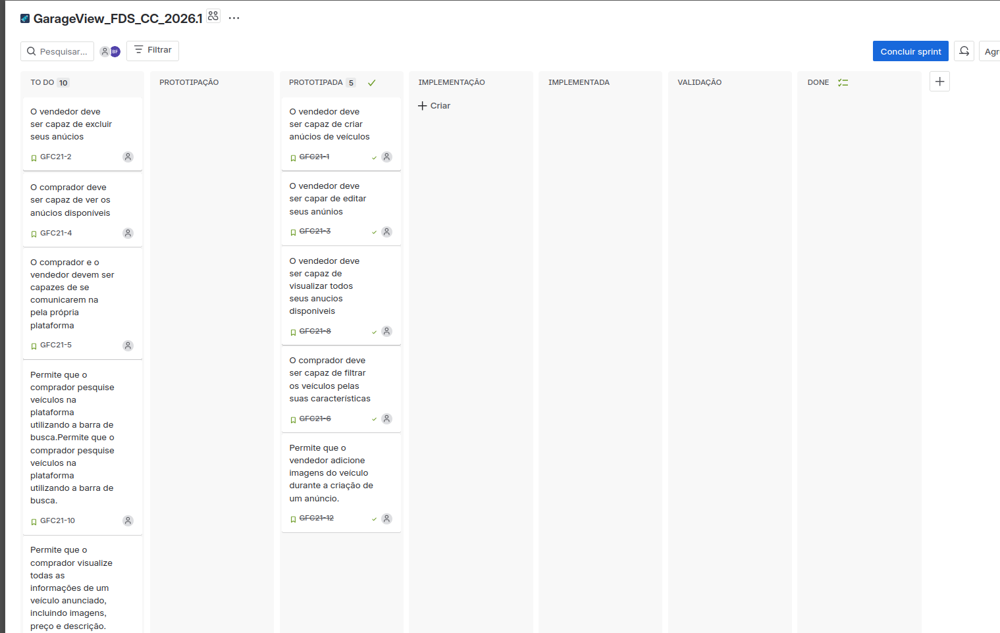

---

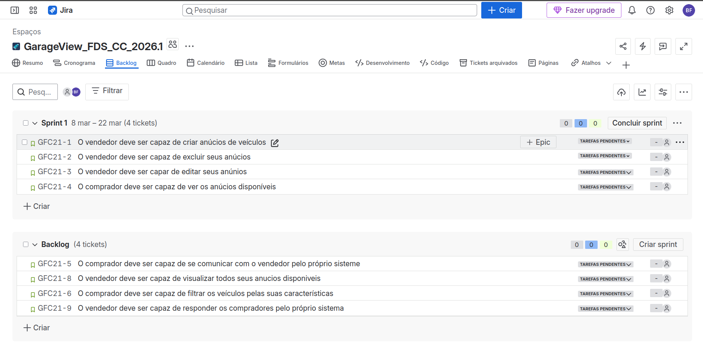
## Protótipos de Lo-Fi

### Pagina Inicial
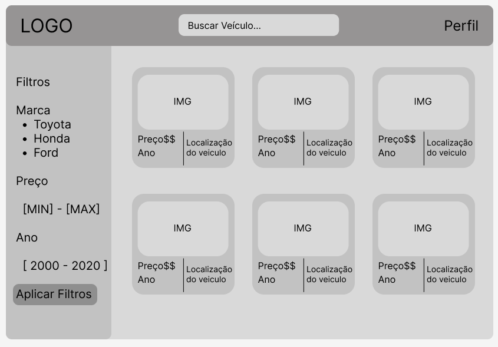

### Anúncio
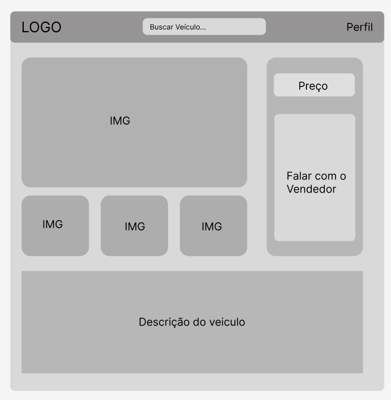

### Criação de Anúncio
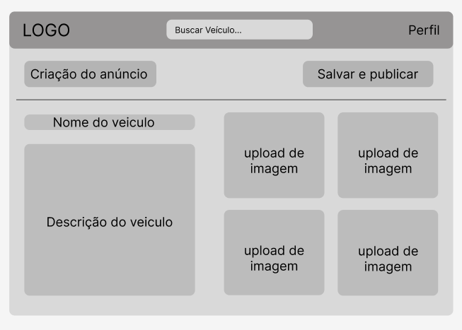

### Meus Anúncios - (Vendedor)
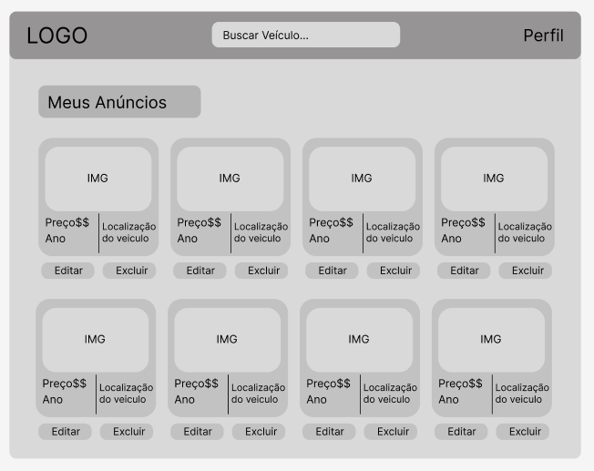
=======

---
## Sreencast
[Vídeo](https://youtu.be/XrmxfoWl5ao?si=crOvMZbUFmec_ggd)

# Entrega 2 - 30/03

## link do Deploy 

[Link do Deply](https://garageview-fds-2.onrender.com/forum/)

## Quadro da Sprint 02 e Backlog 

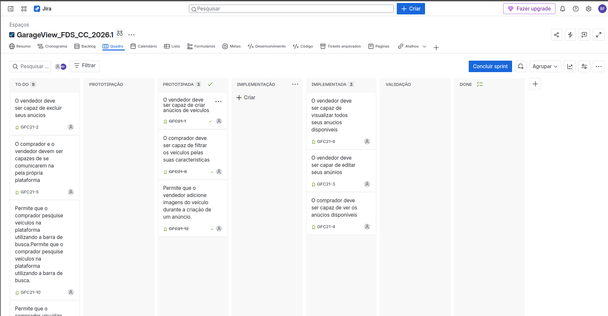
---
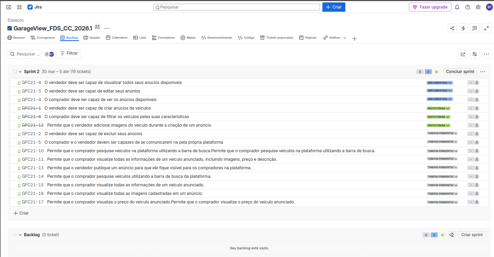

## Programação em par 

grupo optou por não utilizar pair programming principalmente por questões práticas relacionadas à dinâmica do trabalho acadêmico. Como os integrantes possuíam rotinas e horários diferentes, tornou-se difícil sincronizar sessões contínuas de desenvolvimento em conjunto, que são essenciais para essa metodologia. Além disso, a divisão de tarefas permitiu maior paralelismo na execução do projeto, possibilitando que diferentes partes fossem desenvolvidas simultaneamente, otimizando o tempo disponível.

Outro fator relevante foi o nível de familiaridade da equipe com a técnica. Como o pair programming exige prática para ser eficiente, sua adoção poderia inicialmente reduzir a produtividade. Assim, o grupo priorizou uma abordagem mais tradicional, baseada na separação de responsabilidades, garantindo entregas mais rápidas dentro do prazo estabelecido.

## Sreencast

[Video](https://youtu.be/hZ6sR2XvMfE)

# Entrega 3 - 27/04

## Quadro da Sprint 02 e Backlog 

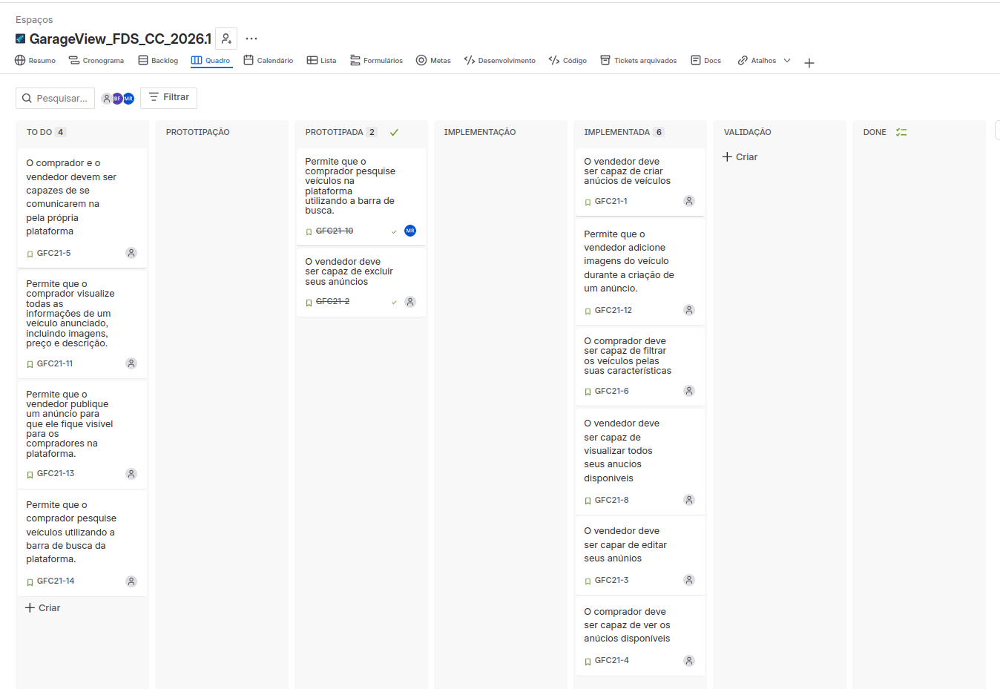
---
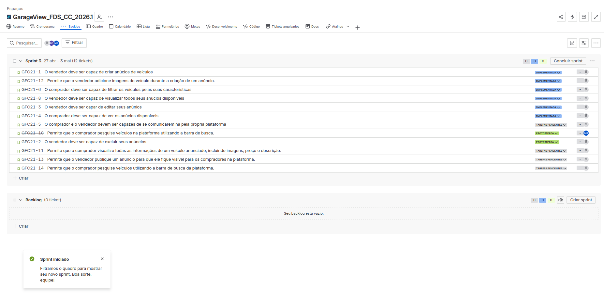

## link do Deploy 

[Link do Deply](https://garageview-fds-2.onrender.com)

## Link dos Videos (YouTube)

[Testes E2E](https://youtu.be/QQzp9_J_IJk)
---
[Screencast](https://youtu.be/GORMSd4rg1U)

## Quadro Sprint referente as entregas 

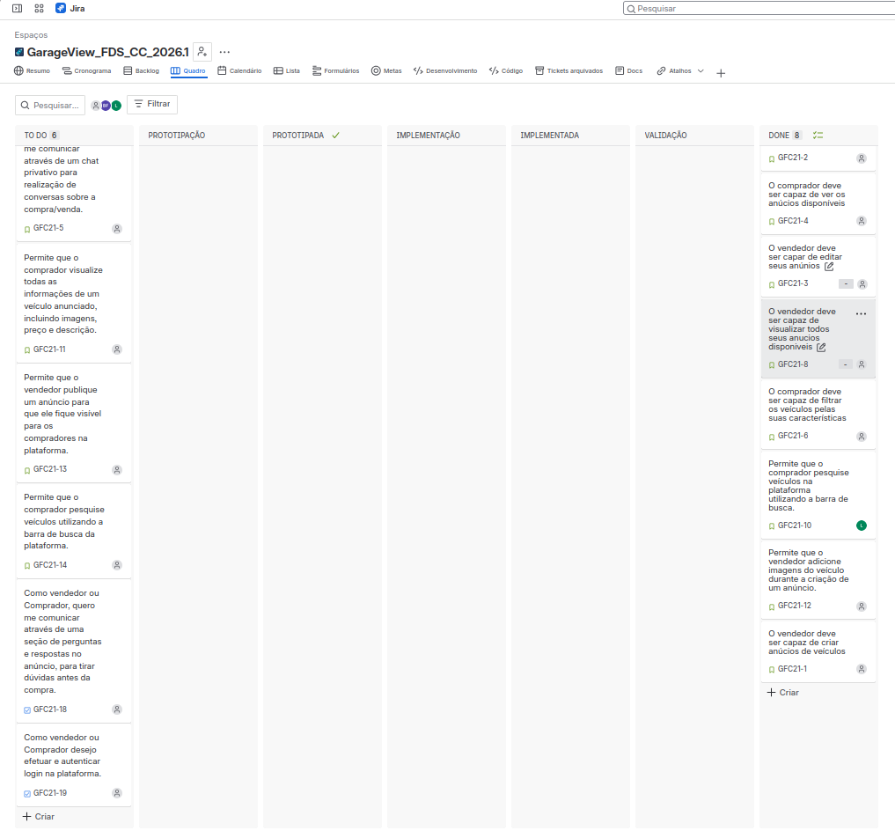

## link relato de programação em pares

[programação em pares](https://docs.google.com/document/d/17JgSQA7zpRymojJEj2hrzNeWvENcwrajrRnmPQVOnKc/edit?usp=sharing)
